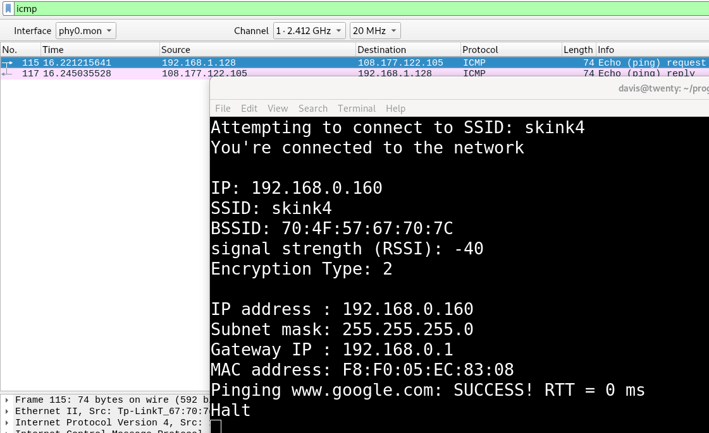
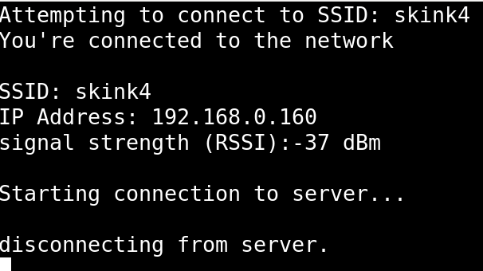
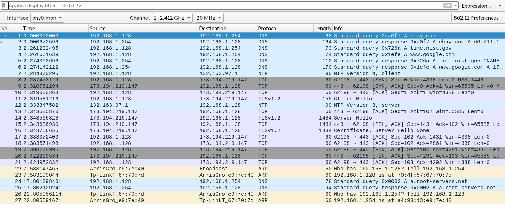
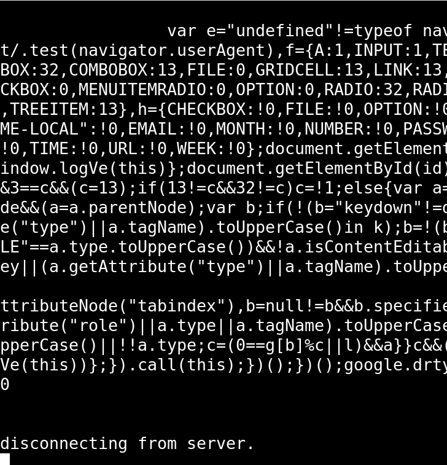
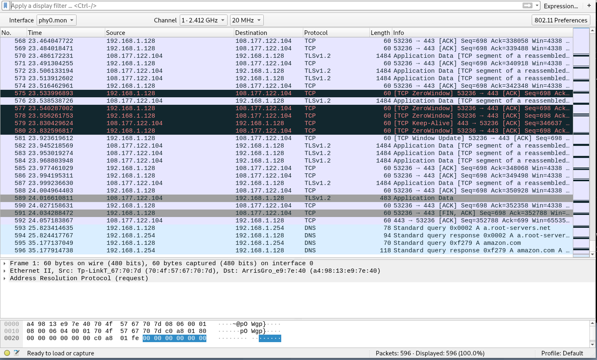
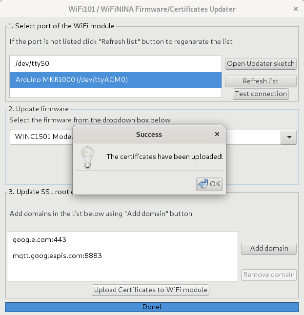
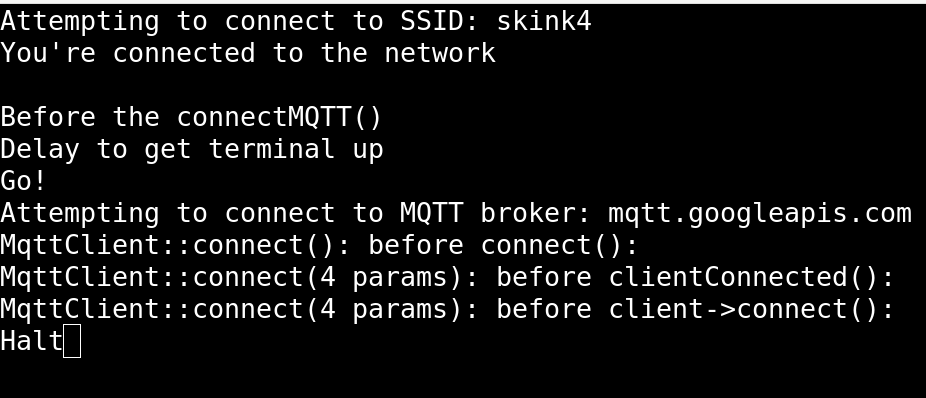
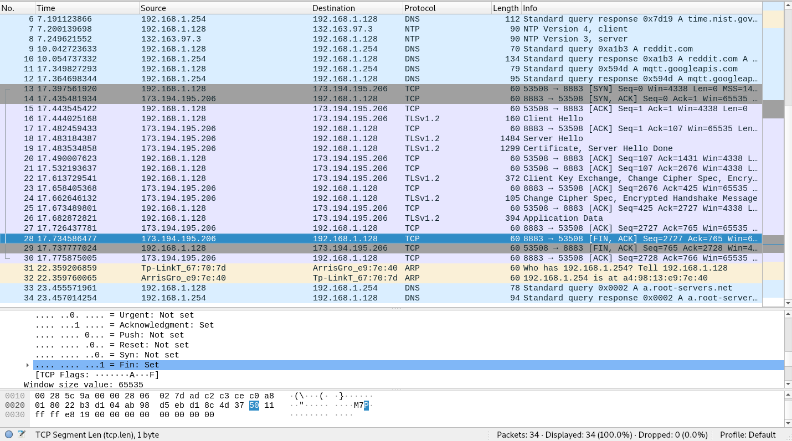
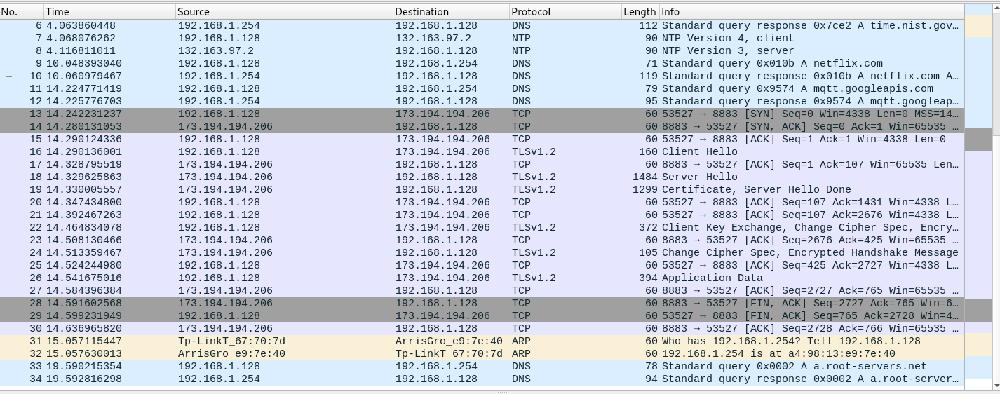

# ssl_publy
ssl capture error discussion

With these websites as a guide
*[Illustrated SSL](https://tls.ulfheim.net/)


After the capture trace I looked at the code and did some experimentation.  
Here is what I know now.  (Hopefully this improves as I continue.)

There are two samples available for connecting to GCP IoT Core  (Google Cloud Platform)

* GCP
* Arduino

The difference is that the Arduino uses the crypto chip and the GCP sample hard codes an SSL 
key in the code.  For simplicity sake I will focus on the Arduino one since it has the 
advantage of using the crypto chip and thus protecting the private key.  Also, I believe it
does away with the crypto code in the google sample.


## ICMP and HTTP/HTTPS on Arduino
20210811

Since I had a hard time understanding SSL and MQTT and Crypto in the google sample, I decided
to narrow the problem.  Lets see what happens with an HTTPS host.  I don't have a lot of 
experience with mosquitto or whatever the mqtt linux program is called. Thus, if I want to use
linux host to debug the problem, I narrow my selection to most likely just it.  I don't want
to have that additional relearn problem with mosquitto.  Curl and wget I have only slightly 
more.  Lol, I have already relearned wireshark for this exercise.

So here is the link to the original arduino sample for https.

[This](https://www.arduino.cc/en/Reference/WiFi101SSLClient) is the WiFi101.h class for 
SSL over wifi.

The sample code on that page does not work as-is for my MKR1000.  I believe this sample is
for a Uno with a wifi shield.  The MKR1000 is an Atmel wifi capable SoC.

Here is the diff and explanation of why.

```
13,15c13
<
< // Why does this sample use SPI?
< //#include <SPI.h>
---
> #include <SPI.h>
```

I cut this part out about SPI and at the time I did not understand why
its here.  Now, I'm thinking probably they are using SPI to talk
to the shield.  Its odd though, I don't see any spi usage in the file.
Anyway, I cut it out and it works.  I figure less is more.

```

17d14
< #include "arduino_secrets.h"
19,21c16,18
< const char ssid[] = MYSSID; //  your network SSID (name)
< const char pass[] = MYSSIDPWD;    // your network password (use for WPA, or use as key for WEP
)
< //int keyIndex = 0;            // your network key Index number (needed only for WEP)
---
> char ssid[] = "yourNetwork"; //  your network SSID (name)
> char pass[] = "secretPassword";    // your network password (use for WPA, or use as key for WE
P)
> int keyIndex = 0;            // your network key Index number (needed only for WEP)
32,34d28
<
<

```


I did the same thing as the google sample here.  I moved
the passwords and SSID to a seperate file named arduino_secrets.h
I also added this file to the git ignore. I did not add an
enrcyption mechanism to encrypt the file and thus keep my 
passwords or use the paid github feature to do similar.  If you
are interested in something like that, look on gitlab for my
git testy repo.

```
< // This example originally uses the WiFiSSLClient()
36,38d29
< // The google gcp example, where I can connect to wifi uses
< // the regular client.
< //WiFiClient client;
47,61c38,42
<
```

Hmm for this bit of code, I'm thinking it might not matter 
which one to use.  I orignally changed this setting because
I thought that was the problem with just the WiFi Shield 
change later.  That is not clear.  The first intial changes
I made to get this working, did not work.  I thought
it might be due to this client class type.  I was having
a failure with the wifi connection at that point. I was
changing this in an effort to fix that.  However I noted
at that time, it really doesn't matter for connecting to
WiFi.  This code uses the WiFi class in the library directory
with the header doing the instantiation.

ie. the WiFi class is used with the join method and this code
does not do a new of that class.

```
< 
<   // the code where I can connect to wifi, does this:
<   Serial.print("Attempting to connect to SSID: ");
<   Serial.print(ssid);
<   Serial.print(" ");
< 
<   status = WiFi.begin(ssid, pass) ;
<   while (WL_CONNECTED != status) {
<     Serial.print("status: ");
<     Serial.println(status);
<     Serial.println("wifi failed to connnect. Trying again in 10 seconds");
<     // failed, retry
<     delay(10000);
<     Serial.println("retry...");
<     status = WiFi.begin(ssid, pass) ;

```

The above is just how I am rewriting it so I can see some 
status messages.

The original is below

```
---
>   // check for the presence of the shield:
>   if (WiFi.status() == WL_NO_SHIELD) {
>     Serial.println("WiFi shield not present");
>     // don't continue:
>     while (true);
63d43
<   Serial.println();
65,66c45,50
<   Serial.println("You're connected to the network");
<   Serial.println();
---
>   // attempt to connect to Wifi network:
>   while (status != WL_CONNECTED) {
>     Serial.print("Attempting to connect to SSID: ");
>     Serial.println(ssid);
>     // Connect to WPA/WPA2 network. Change this line if using open or WEP network:
>     status = WiFi.begin(ssid, pass);
67a52,55
>     // wait 10 seconds for connection:
>     delay(10000);
>   }
>   Serial.println("Connected to wifi");
```

So, if you don't know diff's here is the code in full
without explanation of the changes.

```
/*
This example creates a client object that connects and transfers
data using always SSL.

It is compatible with the methods normally related to plain
connections, like client.connect(host, port).

Written by Arturo Guadalupi
last revision November 2015

*/


// Why does this sample use SPI?
//#include <SPI.h>
#include <WiFi101.h>
#include "arduino_secrets.h"

const char ssid[] = MYSSID; //  your network SSID (name)
const char pass[] = MYSSIDPWD;    // your network password (use for WPA, or use as key for WEP)
//int keyIndex = 0;            // your network key Index number (needed only for WEP)

int status = WL_IDLE_STATUS;
// if you don't want to use DNS (and reduce your sketch size)
// use the numeric IP instead of the name for the server:
//IPAddress server(74,125,232,128);  // numeric IP for Google (no DNS)
char server[] = "www.google.com";    // name address for Google (using DNS)

// Initialize the Ethernet client library
// with the IP address and port of the server
// that you want to connect to (port 80 is default for HTTP):


// This example originally uses the WiFiSSLClient()
WiFiSSLClient client;
// The google gcp example, where I can connect to wifi uses
// the regular client.
//WiFiClient client;

void setup() {
  //Initialize serial and wait for port to open:
  Serial.begin(9600);
  while (!Serial) {
    ; // wait for serial port to connect. Needed for native USB port only
  }


  // the code where I can connect to wifi, does this:
  Serial.print("Attempting to connect to SSID: ");
  Serial.print(ssid);
  Serial.print(" ");

  status = WiFi.begin(ssid, pass) ;
  while (WL_CONNECTED != status) {
    Serial.print("status: ");
    Serial.println(status);
    Serial.println("wifi failed to connnect. Trying again in 10 seconds");
    // failed, retry
    delay(10000);
    Serial.println("retry...");
    status = WiFi.begin(ssid, pass) ;
  }
  Serial.println();

  Serial.println("You're connected to the network");
  Serial.println();

  printWifiStatus();

  Serial.println("\nStarting connection to server...");
  // if you get a connection, report back via serial:
  if (client.connect(server, 443)) {
    Serial.println("connected to server");
    // Make a HTTP request:
    client.println("GET /search?q=arduino HTTP/1.1");
    client.println("Host: www.google.com");
    client.println("Connection: close");
    client.println();
  }
}


void loop() {
  // if there are incoming bytes available
  // from the server, read them and print them:
  while (client.available()) {
    char c = client.read();
    Serial.write(c);
  }

  // if the server's disconnected, stop the client:
  if (!client.connected()) {
    Serial.println();
    Serial.println("disconnecting from server.");
    client.stop();

    // do nothing forevermore:
    while (true);
  }
}


void printWifiStatus() {
  // print the SSID of the network you're attached to:
  Serial.print("SSID: ");
  Serial.println(WiFi.SSID());

  // print your WiFi shield's IP address:
  IPAddress ip = WiFi.localIP();
  Serial.print("IP Address: ");
  Serial.println(ip);

  // print the received signal strength:
  long rssi = WiFi.RSSI();
  Serial.print("signal strength (RSSI):");
  Serial.print(rssi);
  Serial.println(" dBm");
}
```

Now, lets talk about the firmware/certificate upload utility.
I'm going to skip the details of how to use it, since I described
the procedure in a different markdown file.  However I will
show you an experiment to test if the domain certificates are
being used by the firmware not exposed by the header files.  
(Consider those header files like the linux kernel headers.
When you make the jump to the kernel the executable blob is 
already in place just as the arduino executable is and this
code is a program for that environment.  Client.h is visible,
but unless you run a debugger or hunt for the client source
you can't manipulate it unless you use the firmware upload capability
of the firmware/certificate upload utility.  I am skipping using
a ICE.  I am sticking to the tools at hand and not in a drawer.

So, first I'll test what happens when the certs utility is set to none.During this test, the `WiFiSSLClient client;` line is in place as
the original, because we want to see what happens when everything
but the cert in firmware is loaded. See the screenshot for the
setting in the utility.


I can tell you already, it will fail.  It will fail because the stack
does indeed use the domain.  However, lets capture the failure for
later analysis.

Before I do that though, here is an icmp test program.  I'm showing 
this because it explains the ip address problem you will see.
The arduino is on wifi, the console prints the arduino address
as 192.168.0.160.  The capture shows it as 192.168.1.128.



So with that said, I am using a capture filter `host 192.168.1.128` as opposed to a display filter in wireshark.  The capture file is in the [capfiles](./capfiles/) directory.

So, now that we know how to configure wireshark, lets see what happens
when we attempt to connect with HTTPs and no domain cert loaded
in the firmware.

The output and capture file






The capture file is named HTTPS-no-certs-loaded.pcapng

Uploading a cert of google.com:443 with utility and trying again
results in:

That generates a lot of data in console since this sample prints the
contents of a webpage.  It also generates a lot of traffic in wireshark.  These are the screenshots and the capture file is named HTTPS-goog-cert-loaded.pcapng






##
## MQTT to GCP on Arduino

Running [this](https://github.com/arduino/ArduinoCloudProviderExamples/tree/master/examples/Google%20Cloud%20Platform%20IoT%20Core/GCP_IoT_Core_WiFi) code with one change.  Since I am using MKR1000 I switch the 
header as wonderfully commented.

Before I show the capture file and output, let me specify my 
current "ssl" setup.

I have the google.com:443 domain loaded.  I read something about
where people said a fix was to include the cert used to sign 
the other cert.  I'm still unclear on the terms or process.
But, I'm thinking what they are intending is that the 
crypto chip needs the firmware to have the correct cert
loaded before it generates a key.  So with that said
let me add the mqtt cert in case I need that.



```
openssl s_client -connect  mqtt.googleapis.com:8883

$ openssl s_client -connect  mqtt.googleapis.com:8883
CONNECTED(00000003)
depth=2 OU = GlobalSign Root CA - R2, O = GlobalSign, CN = GlobalSign
verify return:1
depth=1 C = US, O = Google Trust Services, CN = GTS CA 1O1
verify return:1
depth=0 C = US, ST = California, L = Mountain View, O = Google LLC, CN = mqtt.googleapis.com
verify return:1

JFD Just a comment, the lines above do not show up in a stdout capture
with the exception of the CONNECTED line.  In that case its more 
readable, but I want to show all the output.
---
Certificate chain
 0 s:C = US, ST = California, L = Mountain View, O = Google LLC, CN = mqtt.googleapis.com
   i:C = US, O = Google Trust Services, CN = GTS CA 1O1
 1 s:C = US, O = Google Trust Services, CN = GTS CA 1O1
   i:OU = GlobalSign Root CA - R2, O = GlobalSign, CN = GlobalSign

---
Server certificate
-----BEGIN CERTIFICATE-----
MIIFtzCCBJ+gAwIBAgIQZYgPVab72N0FAAAAAIgIBDANBgkqhkiG9w0BAQsFADBC
... stuffed deleted
-----END CERTIFICATE-----
subject=C = US, ST = California, L = Mountain View, O = Google LLC, CN = mqtt.googleapis.com

issuer=C = US, O = Google Trust Services, CN = GTS CA 1O1

---
No client certificate CA names sent
Peer signing digest: SHA256
Peer signature type: RSA-PSS
Server Temp Key: X25519, 253 bits
---
SSL handshake has read 3064 bytes and written 391 bytes
Verification: OK
---
New, TLSv1.3, Cipher is TLS_AES_256_GCM_SHA384
Server public key is 2048 bit
Secure Renegotiation IS NOT supported
Compression: NONE
Expansion: NONE
No ALPN negotiated
Early data was not sent
Verify return code: 0 (ok)
---

```
I should note the diff to the .ino file.  Earlier I mentioned
I only changed the include.  I've since done non logic flow mods
to print status.  With that said after the connect error and before
the halt message which stops the loop, I made a change not in the 
screenshot which is 

mqttClient.connectError(): -1



I haven't had time to look at the capture file in detail, but here are some observations:

* I don't see any red packets
* It appears to be looping on the client connecting.  I don't think
this is a wait and it will happen thing.
* I don't know enough about this, but frame 13 is the first frame
to the mqtt host.  Its brown in the screenshot.  In the TCP flags
portion of the frame it has Syn=0.  I believe that is the signal
of this is the start of our conversation in tcp. Likewise 
the mqtt host does the same.  Later the first frame in brown after
the Client sending some application data the mqtt host sends
a frame with Fin=1 set.  I think this is programtically interpeted
as i'm closing the socket.




So let me try to change the crypto chip.  Possibly now that I have
both certs in play in firmware when I run the firmware to generate
the public key to upload to gcp iot core it will work.

### Updating the crypto chip

There are two domains loaded via firmware

* google.com:443
* mqtt.gogapis.somehtingsomeont:8883

There are two key tools which might work for me in the crypto 
chip examples.

* ECCX08SelfSignedCert
* ECCX08JWSPublicKey

I'll try the JWS public key one.  I know this code uses JWT.  
What is a single letter between friends?

Running this code the console says in order to generate a PEM 
public key for your board, I need to pick a slot 0-4.  I chose
0.  I wonder if this corresponds to the order in the firmware
for the domain cert? FWIW, I also said I would like to generate
a new private key in response.

I took the public key and added it to the other keys in gcp for
this device.

-----BEGIN PUBLIC KEY-----
MFkwEwYHKoZIzj0CAQYIKoZIzj0DAQcDQgAENp1a1bFLljzL1D6Dc2jLzd/9Hr3pwi0y4ELGCkBr
/+PuTBkQm0TWu9oQB25Hw6ZbIRaN1ZvOMB+pM4D2Jj0gBQ==
-----END PUBLIC KEY-----

This also fails with similar console message. Error = -1

Here is the associated capture.




##
## Looking at the capture files 
20210812

Looking at HTTPS-goog-and-mqtt-cert-loaded-new-pem.pcapng

I mentioned the client and server Hello frames.  In the first capture file
discussion I mentioned these.  Now, I'm focusing on the next message 
which is the `Certificate, Server Hello Done` message.  This is frame 19.  
I has two certificates listed.

* Certificate: 308205b73082049fa00302010202110089e5c1d471842f7f... (id-at-commonName=mqtt.googleapis.com,id-at-organizationName=Google LLC,id-at-localityName=Mountain View,id-at-stateOrProvinceName=California,id-at-countryName=US)

* Certificate: 3082044a30820332a003020102020d01e3b49aa18d8aa981... (id-at-commonName=GTS CA 1O1,id-at-organizationName=Google Trust Services,id-at-countryName=US)

Both of these certs are specified as version v3 (2).

Both of these certs are specified as algorithm identifier sha256WithRSAEncryption.

Frame 22 is the next SSL frame and its from the client.  The client sends a 
Client Key Exxchange, Change Cipher Spec, ...

This leads me to believe the client cant support the algorithm.

Hmm.  Looking back at frame 16 which is the Client Hello 
message.  It lists five cipher suites:

* TLS RSA WITH AES 128 GCM SHA256
* TLS RSA WITH AES 256 CBC SHA256
* TLS RSA WITH AES 128 CBC SHA256
* TLS RSA WITH AES 256 CBC SHA
* TLS RSA WITH AES 128 CBC SHA

Looking at the HTTPS google web fetch capture file, 
I see that this pattern is similar.  The server
sent the same two SSL certificates and then the client
sent the same Change Cipher Spec frame. The similarity 
continues, the client sent Encrypted Application Data.
In fact the client sends 10 Encrypted Applicaiton Data
before the server responds with more than 20 Encrypted 
Application Data packets.  Remember in this scenario
the arduino pulled down a webpage over https.

This is similar but differnt from the MQTT exchange.
The handshake seems the same and everything looks 
the same until the Client sends one Encrypted 
Application Data frame.  At that point, the server
sends an ack frame of the last message - its tcp - 
then it sends the frame with the Fin=1 flag set
closing the socket.

Why?

## Summary Sent to mailing list
##
```
Hmm.  I compared the traffic between the HTTPS client which works and the SSL/MQTT which fails.
Both scenarios start the same
1. Client Hello2. Server Hello3. Certificate, Server Hello Done
I examined the Certificate frame in either case and they were the same two certificates.  
4.  Client Key Exchange, Change Cipher Spec, Encrypted Handshake Message 
The client sends the same headers for each message: TLS1.2.  I did not compare the Encrypted Handshake Message.
5. Change Cipher Spec, Encrypted Handshake Message
The server sends this message.  I don't see anything in particular in these two fields.  I'm guessing its an ack thatit read the message.
And then is where it differs, the client in both cases sends Encrypted Applicaiton Data.  However, in the case of the HTTPS client(ardujono), it sends around 10 of these frames to the server.  Then in the case of the HTTPS, theserver sends more than 30 frames in response.  In the MQTT situation after the client sends one frame of the Encruyptedapplication data, the server sends a ACK frame and then a ACK Fin=1 frame.

This is covered here in more detail https://github.com/netskink/ssl_publy 
```

## Archive capture file
This is a 202108 or 07 capture file.  After this one, I modifed the firmware and crypto.
I also made other changes but I can't remember in detail what I did.  Consider it a wireshark 
tutorial.

Its worth looking at if you don't know wireshark.

see [crash_dump.md](capture_dump.md)

