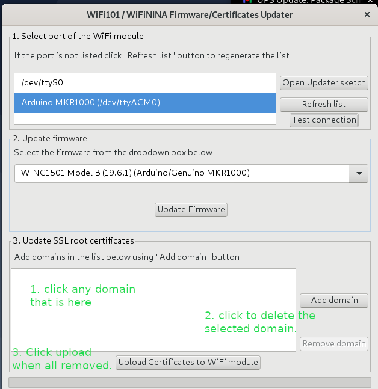

# ssl_publy
ssl capture error discussion

With these websites as a guide
*[Illustrated SSL](https://tls.ulfheim.net/)


After the capture trace I looked at the code and did some experimentation.  
Here is what I know now.  (Hopefully this improves as I continue.)

There are two samples available for connecting to GCP IoT Core  (Google Cloud Platform)

* GCP
* Arduino

The difference is that the Arduino uses the crypto chip and the GCP sample hard codes an SSL 
key in the code.  For simplicity sake I will focus on the Arduino one since it has the 
advantage of using the crypto chip and thus protecting the private key.  Also, I believe it
does away with the crypto code in the google sample.


## HTTP/HTTPS on Arduino
20210811

Since I had a hard time understanding SSL and MQTT and Crypto in the google sample, I decided
to narrow the problem.  Lets see what happens with an HTTPS host.  I don't have a lot of 
experience with mosquitto or whatever the mqtt linux program is called. Thus, if I want to use
linux host to debug the problem, I narrow my selection to most likely just it.  I don't want
to have that additional relearn problem with mosquitto.  Curl and wget I have only slightly 
more.  Lol, I have already relearned wireshark for this exercise.

So here is the link to the original arduino sample for https.

[This](https://www.arduino.cc/en/Reference/WiFi101SSLClient) is the WiFi101.h class for 
SSL over wifi.

The sample code on that page does not work as-is for my MKR1000.  I believe this sample is
for a Uno with a wifi shield.  The MKR1000 is an Atmel wifi capable SoC.

Here is the diff and explanation of why.

```
13,15c13
<
< // Why does this sample use SPI?
< //#include <SPI.h>
---
> #include <SPI.h>
```

I cut this part out about SPI and at the time I did not understand why
its here.  Now, I'm thinking probably they are using SPI to talk
to the shield.  Its odd though, I don't see any spi usage in the file.
Anyway, I cut it out and it works.  I figure less is more.

```

17d14
< #include "arduino_secrets.h"
19,21c16,18
< const char ssid[] = MYSSID; //  your network SSID (name)
< const char pass[] = MYSSIDPWD;    // your network password (use for WPA, or use as key for WEP
)
< //int keyIndex = 0;            // your network key Index number (needed only for WEP)
---
> char ssid[] = "yourNetwork"; //  your network SSID (name)
> char pass[] = "secretPassword";    // your network password (use for WPA, or use as key for WE
P)
> int keyIndex = 0;            // your network key Index number (needed only for WEP)
32,34d28
<
<

```


I did the same thing as the google sample here.  I moved
the passwords and SSID to a seperate file named arduino_secrets.h
I also added this file to the git ignore. I did not add an
enrcyption mechanism to encrypt the file and thus keep my 
passwords or use the paid github feature to do similar.  If you
are interested in something like that, look on gitlab for my
git testy repo.

```
< // This example originally uses the WiFiSSLClient()
36,38d29
< // The google gcp example, where I can connect to wifi uses
< // the regular client.
< //WiFiClient client;
47,61c38,42
<
```

Hmm for this bit of code, I'm thinking it might not matter 
which one to use.  I orignally changed this setting because
I thought that was the problem with just the WiFi Shield 
change later.  That is not clear.  The first intial changes
I made to get this working, did not work.  I thought
it might be due to this client class type.  I was having
a failure with the wifi connection at that point. I was
changing this in an effort to fix that.  However I noted
at that time, it really doesn't matter for connecting to
WiFi.  This code uses the WiFi class in the library directory
with the header doing the instantiation.

ie. the WiFi class is used with the join method and this code
does not do a new of that class.

```
< 
<   // the code where I can connect to wifi, does this:
<   Serial.print("Attempting to connect to SSID: ");
<   Serial.print(ssid);
<   Serial.print(" ");
< 
<   status = WiFi.begin(ssid, pass) ;
<   while (WL_CONNECTED != status) {
<     Serial.print("status: ");
<     Serial.println(status);
<     Serial.println("wifi failed to connnect. Trying again in 10 seconds");
<     // failed, retry
<     delay(10000);
<     Serial.println("retry...");
<     status = WiFi.begin(ssid, pass) ;

```

The above is just how I am rewriting it so I can see some 
status messages.

The original is below

```
---
>   // check for the presence of the shield:
>   if (WiFi.status() == WL_NO_SHIELD) {
>     Serial.println("WiFi shield not present");
>     // don't continue:
>     while (true);
63d43
<   Serial.println();
65,66c45,50
<   Serial.println("You're connected to the network");
<   Serial.println();
---
>   // attempt to connect to Wifi network:
>   while (status != WL_CONNECTED) {
>     Serial.print("Attempting to connect to SSID: ");
>     Serial.println(ssid);
>     // Connect to WPA/WPA2 network. Change this line if using open or WEP network:
>     status = WiFi.begin(ssid, pass);
67a52,55
>     // wait 10 seconds for connection:
>     delay(10000);
>   }
>   Serial.println("Connected to wifi");
```

So, if you don't know diff's here is the code in full
without explanation of the changes.

```
/*
This example creates a client object that connects and transfers
data using always SSL.

It is compatible with the methods normally related to plain
connections, like client.connect(host, port).

Written by Arturo Guadalupi
last revision November 2015

*/


// Why does this sample use SPI?
//#include <SPI.h>
#include <WiFi101.h>
#include "arduino_secrets.h"

const char ssid[] = MYSSID; //  your network SSID (name)
const char pass[] = MYSSIDPWD;    // your network password (use for WPA, or use as key for WEP)
//int keyIndex = 0;            // your network key Index number (needed only for WEP)

int status = WL_IDLE_STATUS;
// if you don't want to use DNS (and reduce your sketch size)
// use the numeric IP instead of the name for the server:
//IPAddress server(74,125,232,128);  // numeric IP for Google (no DNS)
char server[] = "www.google.com";    // name address for Google (using DNS)

// Initialize the Ethernet client library
// with the IP address and port of the server
// that you want to connect to (port 80 is default for HTTP):


// This example originally uses the WiFiSSLClient()
WiFiSSLClient client;
// The google gcp example, where I can connect to wifi uses
// the regular client.
//WiFiClient client;

void setup() {
  //Initialize serial and wait for port to open:
  Serial.begin(9600);
  while (!Serial) {
    ; // wait for serial port to connect. Needed for native USB port only
  }


  // the code where I can connect to wifi, does this:
  Serial.print("Attempting to connect to SSID: ");
  Serial.print(ssid);
  Serial.print(" ");

  status = WiFi.begin(ssid, pass) ;
  while (WL_CONNECTED != status) {
    Serial.print("status: ");
    Serial.println(status);
    Serial.println("wifi failed to connnect. Trying again in 10 seconds");
    // failed, retry
    delay(10000);
    Serial.println("retry...");
    status = WiFi.begin(ssid, pass) ;
  }
  Serial.println();

  Serial.println("You're connected to the network");
  Serial.println();

  printWifiStatus();

  Serial.println("\nStarting connection to server...");
  // if you get a connection, report back via serial:
  if (client.connect(server, 443)) {
    Serial.println("connected to server");
    // Make a HTTP request:
    client.println("GET /search?q=arduino HTTP/1.1");
    client.println("Host: www.google.com");
    client.println("Connection: close");
    client.println();
  }
}


void loop() {
  // if there are incoming bytes available
  // from the server, read them and print them:
  while (client.available()) {
    char c = client.read();
    Serial.write(c);
  }

  // if the server's disconnected, stop the client:
  if (!client.connected()) {
    Serial.println();
    Serial.println("disconnecting from server.");
    client.stop();

    // do nothing forevermore:
    while (true);
  }
}


void printWifiStatus() {
  // print the SSID of the network you're attached to:
  Serial.print("SSID: ");
  Serial.println(WiFi.SSID());

  // print your WiFi shield's IP address:
  IPAddress ip = WiFi.localIP();
  Serial.print("IP Address: ");
  Serial.println(ip);

  // print the received signal strength:
  long rssi = WiFi.RSSI();
  Serial.print("signal strength (RSSI):");
  Serial.print(rssi);
  Serial.println(" dBm");
}
```

Now, lets talk about the firmware/certificate upload utility.
I'm going to skip the details of how to use it, since I described
the procedure in a different markdown file.  However I will
show you an experiment to test if the domain certificates are
being used by the firmware not exposed by the header files.  
(Consider those header files like the linux kernel headers.
When you make the jump to the kernel the executable blob is 
already in place just as the arduino executable is and this
code is a program for that environment.  Client.h is visible,
but unless you run a debugger or hunt for the client source
you can't manipulate it unless you use the firmware upload capability
of the firmware/certificate upload utility.  I am skipping using
a ICE.  I am sticking to the tools at hand and not in a drawer.

So, first I'll test what happens when the certs utility is set to none.During this test, the `WiFiSSLClient client;` line is in place as
the original, because we want to see what happens when everything
but the cert in firmware is loaded. See the screenshot for the
setting in the utility.




## Archive capture file
This is a 202108 or 07 capture file.  After this one, I modifed the firmware and crypto.
I also made other changes but I can't remember in detail what I did.  Consider it a wireshark 
tutorial.
see [crash_dump.md](capture_dump.md)

