# Capture Dump Notes

Looking at arduino-ssl-ethertap-only-goog-domain-halt-004.pcapng

Notes about this capture file

* using wifi access point on same router as lan.
* no other traffic on the lan with possible exception of printer
* only arduino knows ssid/pass

On boot the arduino does the following:

1. uses ntp to sync time with nist.gov 
  frame 192
2. pings google
  frame 193
3. opens webpage to www.google.com
  frame 250
4. Attempts to upload telemetry 74.125.202.206 (gcp iot core mqtt endpoint)
  frame 333

In detail, this exchange requires arp, dns queries, etc.  Some of the simpler
bits of the exchange are mentioned here with screenshots of the capture file 
and discussion.  If nothing else, it shows how to read the decode before
we get to the problem of why ssl mqtt fails.

A couple of notes regarding the wireshark UI.  Notice the filter at top
in green.   That is the display filter.  It allows you to filter frames
from the capture file.  

Since the first frame is selected as the first line in blue of the top panel,
it is showing the networking frames in layers in the middle panel.  In my 
screenshots, most of the image will have the bottom minimized.  That 
panel shows the raw frame.  As you click on items in the middle panel 
it will highlight the relevant bytes in the frame corresponding the clicked
item.

1. joins network.  You can see that in the wifi probe requests and 
probe responses in the other capture files.

2. dhcp request and response.  That is also visible in a wifi capture.

3. dns request and response for ntp time server.  This is shown in 
frame 177.  Notice the name of the time server `time.nist.gov` is visible
in the lower panel as I select the query host portion in the middle panel.

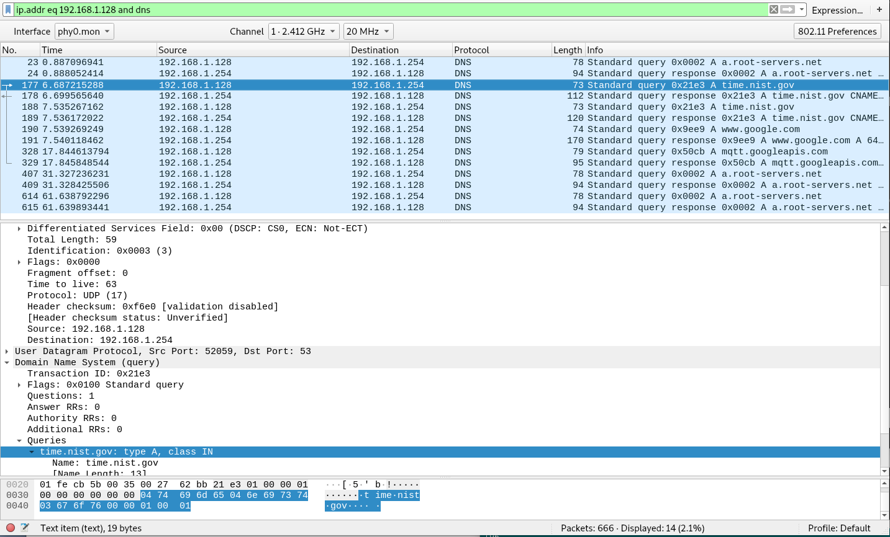

Frame 178 which is the dns response and the screenshot shows the 
ip address of 128.138.141.172.  

```
$ nslookup 128.138.141.172
172.141.138.128.in-addr.arpa	name = utcnist2.colorado.edu.
```

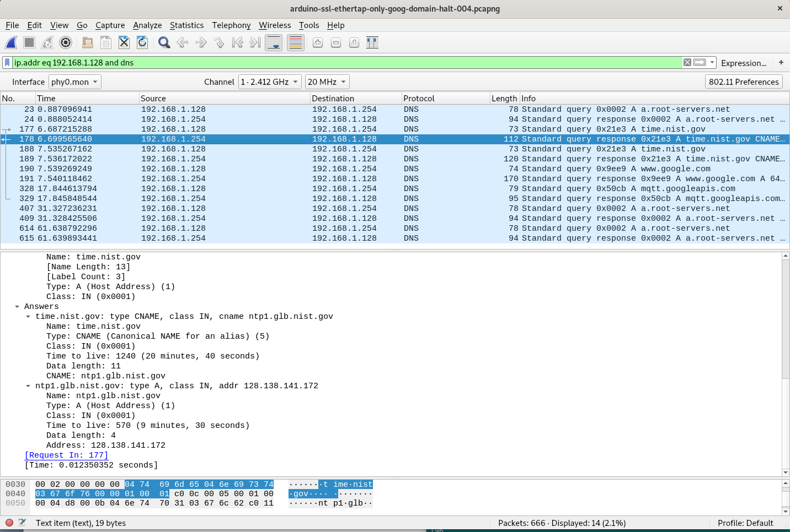


4. ntp time sync with `time.nist.gov`

Frame 192 shows the ntp request and response.

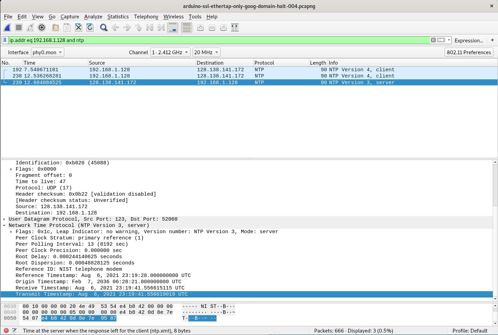

5. ping to google.com

This involves the dns request and response.  This is shown in 
wireshark starting at frame 193 and 194.

In this screenshot, if you haven't noticed it already, the arrows in the 
leftmost frame number column show the start of a conversation and end.
In this example its a ping request and response.

Notice also how the destination address line is selected in the middle 
panel.  Its how ping knows where to send the packet.

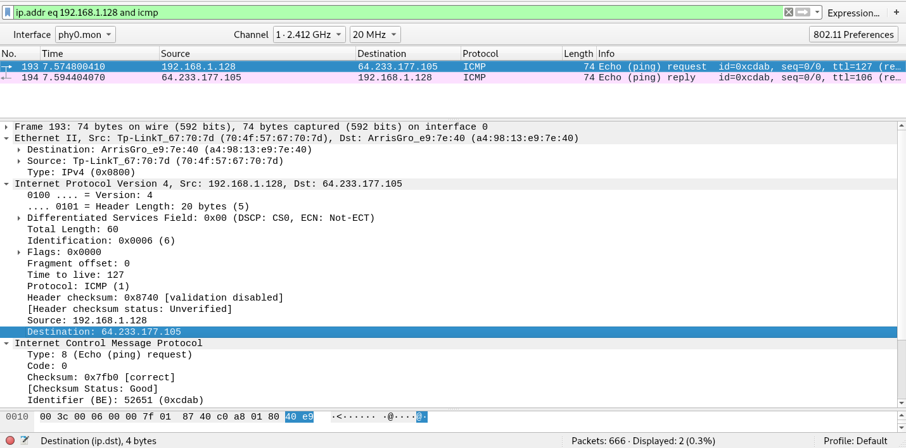

6. web fetch google.com

Frame 250
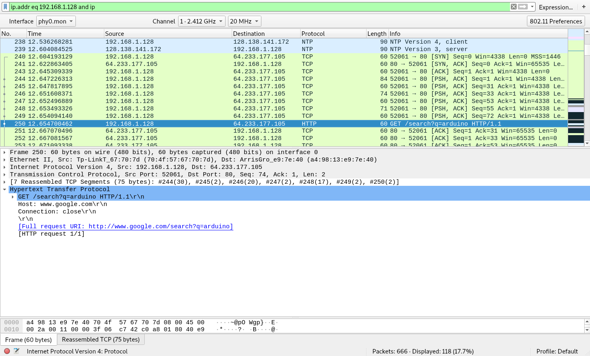

Frame 240 is the dns request.

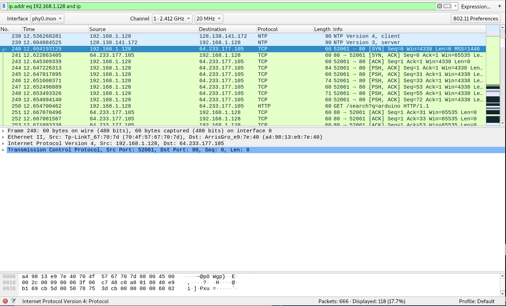

```
$ nslookup 64.233.177.105
105.177.233.64.in-addr.arpa	name = yx-in-f105.1e100.net.
```

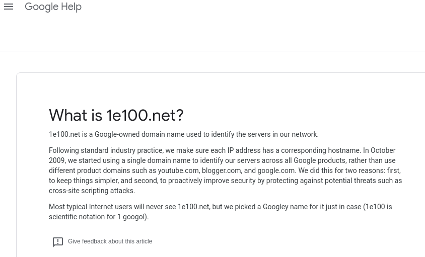


7. Start of the mqtt/ssl connection to GCP iot core.

Frame 328 DNS Query of mqtt.googleapis.com the "MQTT broker"


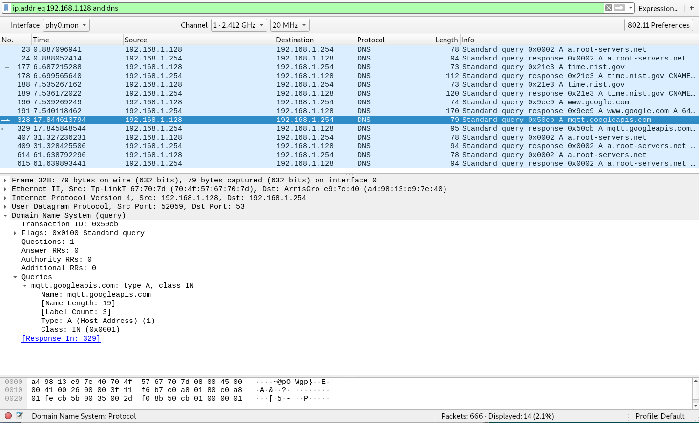

Frame 329 DNS Response of mqtt.googleapis.com 74.125.202.206

```
$ nslookup 74.125.202.206
206.202.125.74.in-addr.arpa	name = io-in-f206.1e100.net.

Notice this?

$ nslookup mqtt.googleapis.com
Server:		192.168.86.1
Address:	192.168.86.1#53

Non-authoritative answer:
Name:	mqtt.googleapis.com
Address: 74.125.69.206
Name:	mqtt.googleapis.com
Address: 74.125.69.206
Name:	mqtt.googleapis.com
Address: 74.125.69.206
... stuff truncated

```

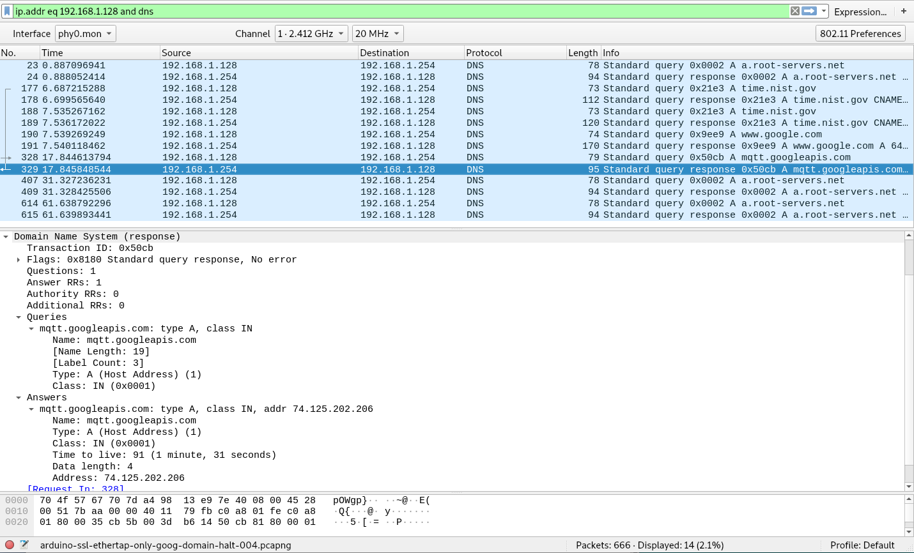


8.  The start of the MQTT conversation

Frame 330 Shows a new filter.  Its just the traffic regarding the
mqtt host.


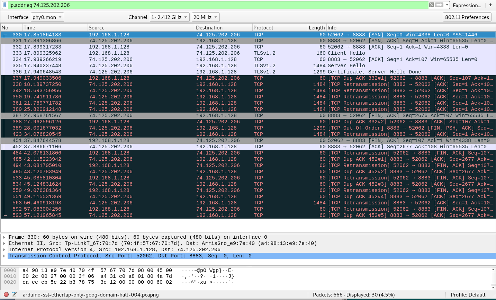

9. The Client Hello frame
Keeping the illustrated SSL guide in mind, look at the Client 
Hello frame.  I'll show multplie screenshots of this section 
as I examine it.  

Frame 333 the client hello with list of cipher 


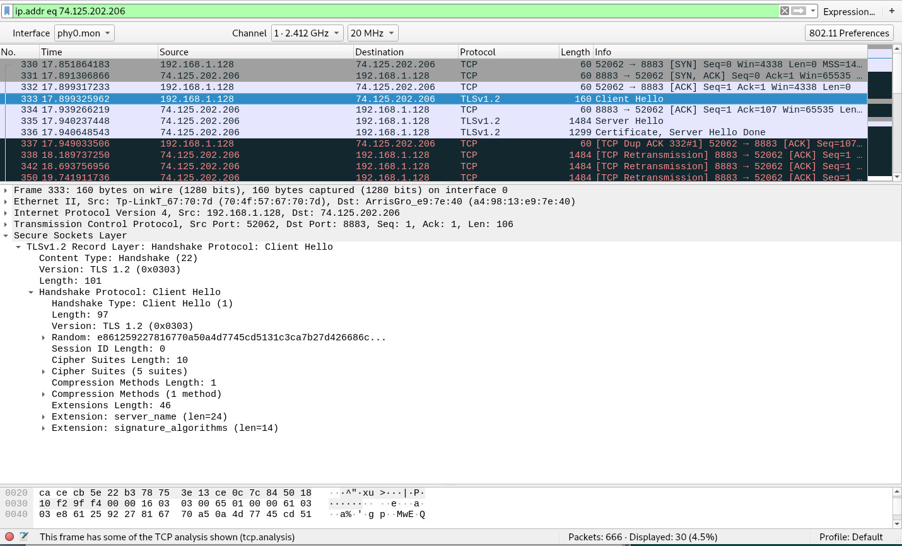

The five cipher suites available by the arduino/client are:

* RSA AES 128 GCM SHA256
* RSA AES 256 CBC SHA256
* RSA AES 128 CBC SHA256
* RSA AES 256 CBC SHA
* RSA AES 128 GCM SHA

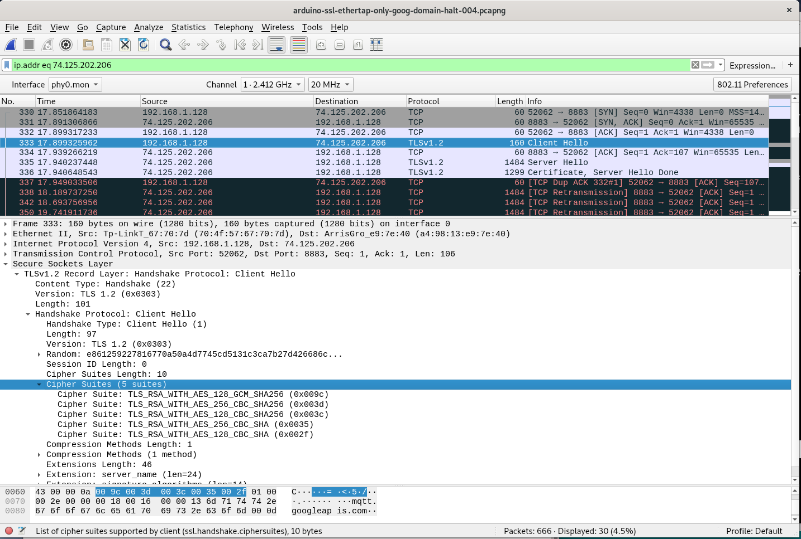

Let's take a look at the header file for the crypto chip (ECCX08.h) on the arduino.
Sadly it does not list algorithms.  The closest thing of interest is the
sha256 routine.


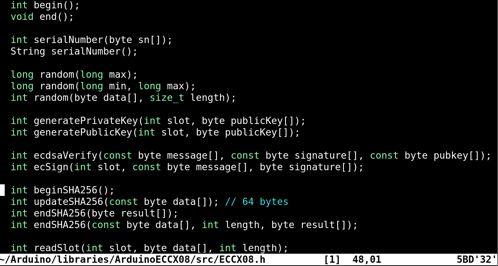

Let's take a moment to look at the crypto chip on the board.  [Here](https://www.microchip.com/en-us/product/atecc508a)

In feature description are some important excerpts, listed here:

* Easy way to run ECDSA and ECDH Key Agreement
* Performs High-Speed Public Key (PKI) Algorithms
* NIST Standard P256 Elliptic Curve Support
* SHA-256 Hash Algorithm with HMAC Option
* Host and Client Operations
* 256-bit Key Length
* Storage for up to 16 Keys
* ECC P256 (ECDH and ECDSA), SHA256

I wonder about how here it says 256-bit but the software is returning algorithms
with 128 and 256 bit.  The important thing though is ES256 which it explicitly 
states in third  bullet.  That was the chosen algorithm in the GCP console.
Note gcp mentioned ES256_x509 which is the x509 wrapper around the ES256 key.
At least I think its X509,, lol.


10. The Server Hello frame

Frame 335 is the Server Hello frame.  Notice the server only has one cipher suite:
`TLS_RSA_WITH_AES_128_GCM_SHA256`.  Hmm, that is the first listed client supported
algorithm.

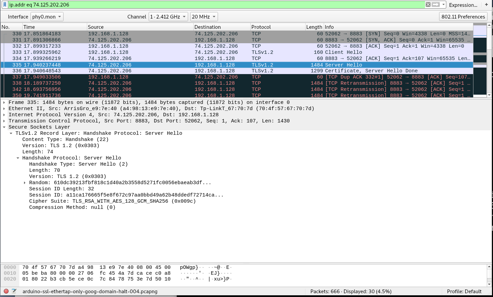


11.  The error

So after the Server gives its supported algorithm, the arduino starts sending old data out?  The next frames are highlighted in red and decoded as duplicates.  Is the stack messed up?  Wireshark says its a duplicate ACK to frame 332.

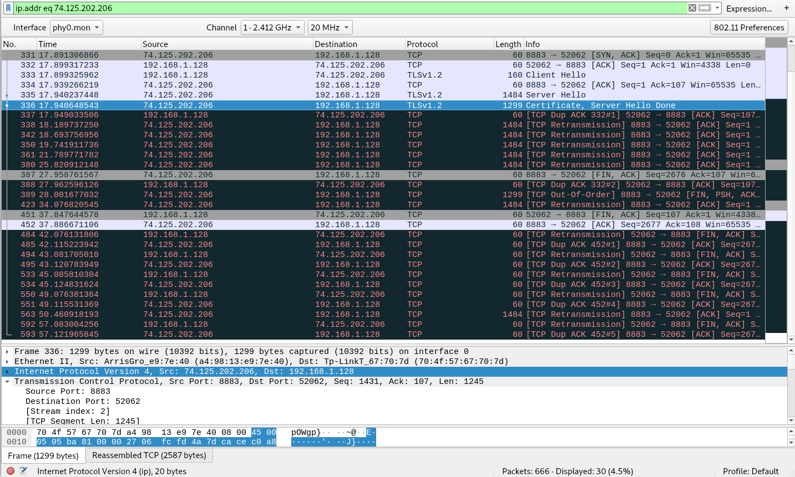
What now big boy?


